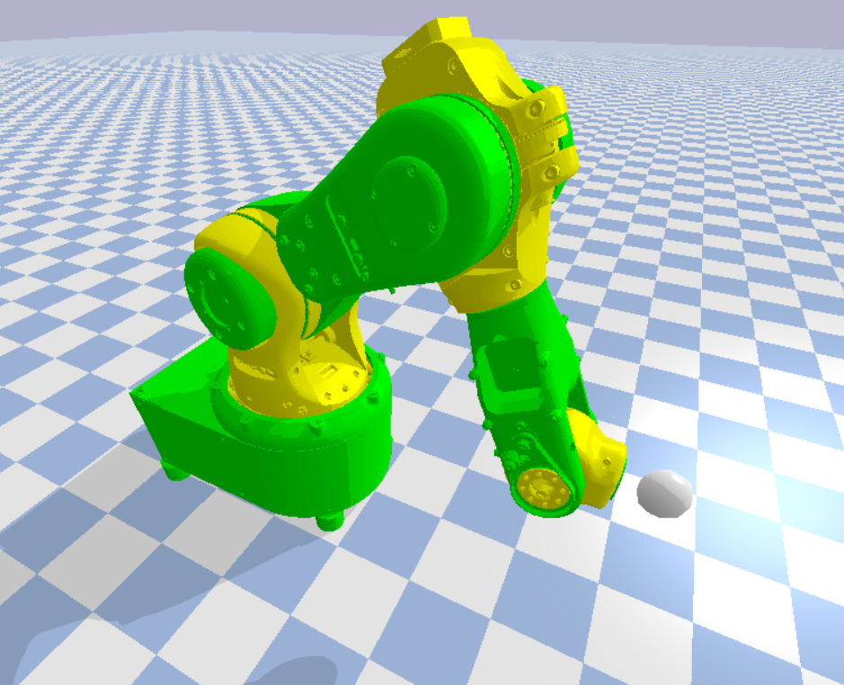

# mantisBullet
pybullet example and urdf files for the mantis robot arm 



there are simplified stl files of the mantis robot arm in the ``` ./mantis/visual/link_X.stl``` folder. Each stl origin is the origin of it's link. So no creasy transformations are needed. Right now there are no special collision models. 


## Demo

``` mantisrobot_minimal.py ``` is a very simple script where the arm tracks a target. You can manipulate the target with mouse drag and drop. 

``` mantisrobot_3DM.py ```
is a simple demo to control the robot with a 3D Connexion Spacemouse

it needs the [pyspacenavigator](https://github.com/johnhw/pyspacenavigator) and  [pywinusb](https://pypi.python.org/pypi/pywinusb/)

## Installation 
you need to install [pybullet](https://pybullet.org/wordpress/)
``` 
pip install pybullet 
```


## The URDF file
```mantisrobot_urdf.py ```
generates the urdf files for the manatis robot you only need to run this if you want to change the robots parameter 

to create the urdf I used the excellent python lib [odio_urdf](https://github.com/hauptmech/odio_urdf) for this install catkin via pip
```
pip install catkin_pkg
```
then clone the lib to your working dir
```
git clone https://github.com/hauptmech/odio_urdf.git
```
and run
```
python setup.py install
```
